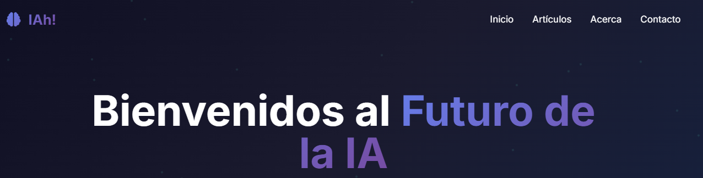

# 🤖 IAh! – Inteligencia Artificial con Pasión y Propósito

> _"La curiosidad solo mata al gato."_  
> **Pero a mí me impulsa a aprender, crear y compartir.**

## 🌐 ¿Qué es este blog?

**IAh!** no es solo un blog sobre inteligencia artificial. Es un espacio para mostrar que **la IA no es el futuro, es el presente**, y que **nunca es tarde para impulsar tu carrera **, sin importar tu edad, tu background o tus horarios.

Mi objetivo es **integrar conocimientos diversos**, como la inteligencia artificial, la tecnología y mi experiencia previa en otros campos, para:

- 💡 Aplicar lo que aprendo en **soluciones innovadoras** con impacto real  
- 🤝 Conectar con una **comunidad diversa y curiosa**  
- 🎓 Demostrar que se puede **aprender IA desde cero**.

## ✨ ¿Qué vas a encontrar?

- 📰 Novedades sobre el mundo tech
- 🧾 Artículos e investigaciones sobre inteligencia artificial
- 📊 Reportes y visualizaciones de datos sobre temas actuales
- 🎤 Charlas y experiencias personales
- 🧠 Proyectos reales explicados paso a paso
- 🔧 Herramientas para que vos también te animes


---

## 🖼️ Portada del blog

 


## Aviso Legal y Derechos de Autor

Este blog, **IAh!**, así como todo su contenido (artículos, diseños, código fuente, recursos gráficos y multimedia) son de mi autoría y están protegidos por derechos de autor.  
Queda prohibida su copia, distribución, modificación o uso total sin mi autorización previa por escrito.  
 
Se permite mencionar el blog, el contenido o compartirlo siempre que se **cite la fuente y se me acredite como autora**.  

© 2025 Gabriela Coronel – Todos los derechos reservados.

```markdown

